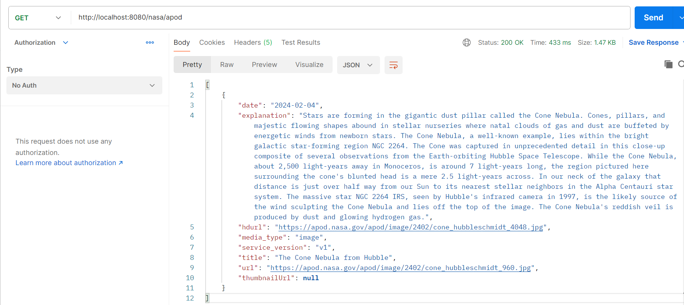
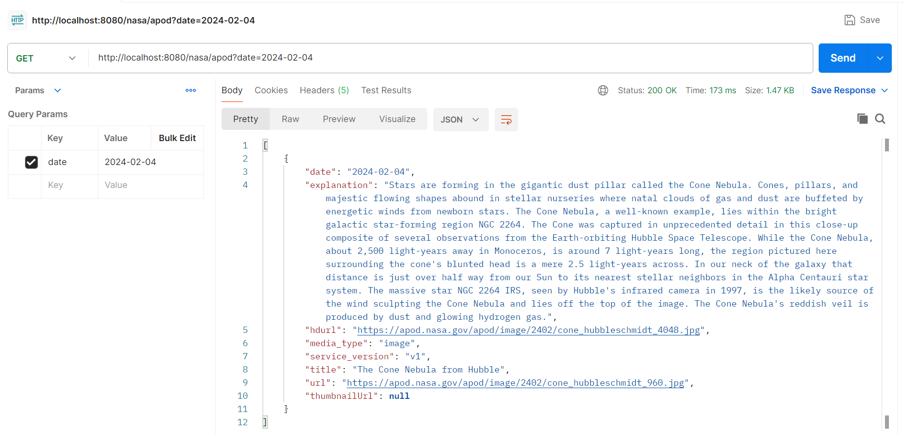
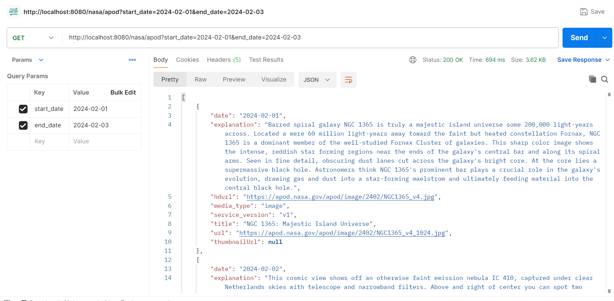
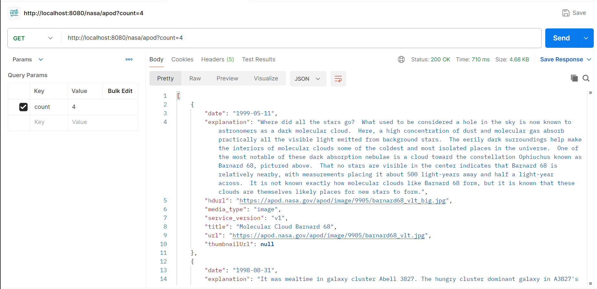
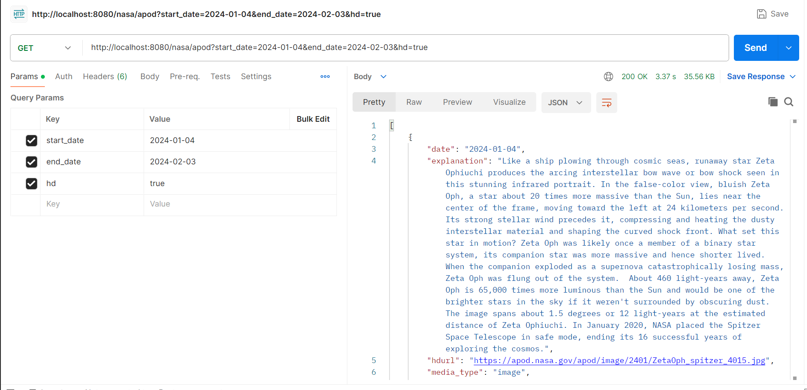
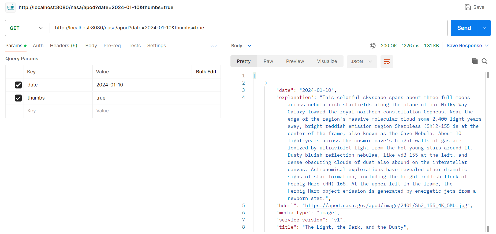

# Nasa Api APOD Spring API Project

## Project Repository
The source code for this project is hosted on GitHub. You can find it [here](https://github.com/komalivikas/WebEng_Assignment1_Nasa).

## Introduction: ##

The Nasa Api APOD Spring API Project is a Spring Boot application designed to interact with NASA's Astronomy Picture of the Day (APOD) API. It serves as a versatile tool for fetching and displaying space-related content, offering a range of features to cater to different user needs.

## Key Features: ##

- Flexible Query Parameters: The API supports various query parameters such as date, start date, end date, count, high-definition content retrieval (hd), and inclusion of thumbnail URLs for videos (thumbs).
- Ease of Integration: The project is built on Spring Boot, providing a robust and easily extensible framework for integrating with NASA's APOD API.
- Detailed Endpoint Documentation: The README includes a comprehensive guide to the available endpoints, complete with examples and screenshots.

## Project Structure: ##

NasaController: This class contains the endpoint mappings for interacting with the NASA APOD API. It handles incoming requests and communicates with the NasaService to fetch data.

NasaService: The service class is responsible for interacting with the NASA APOD API. It utilizes a RestTemplate to make HTTP requests and handles the logic for parsing and processing API responses.

## NASA API Endpoint: ##

The project includes endpoint to retrieve information from NASA's Astronomy Picture of the Day (APOD) API.

**Parameters:**
- `date` 		: The date for which we want the APOD. Format: YYYY-MM-DD.
- `startDate`	: Start date for fetching content in the format YYYY-MM-DD.
- `endDate`		: End date for fetching content in the format YYYY-MM-DD.
- `count`		: Number of entries to fetch. If not specified, defaults to 1.
- `hd`			: Specify true to retrieve high-definition content.
- `thumbs`		: Specify true to include thumbnail URLs for videos.

**Endpoint:**

Method: GET

- **Fetch the latest space-related content:**
http://localhost:8080/nasa/apod

- **Fetch content for a specific date:**
http://localhost:8080/nasa/apod?date=2024-02-04

- **Fetch content for multiple entries/ Range of dates:**
http://localhost:8080/nasa/apod?start_date=2024-02-01&end_date=2024-02-03

- **Fetch content for multiple entries for a given Count**
http://localhost:8080/nasa/apod?count=4

- **Fetch content for multiple entries with HD images:**
http://localhost:8080/nasa/apod?start_date=2024-01-04&end_date=2024-02-03&hd=true

- **Fetch content for a specific date with thumbnails:**
http://localhost:8080/nasa/apod?date=2024-01-10&thumbs=true

